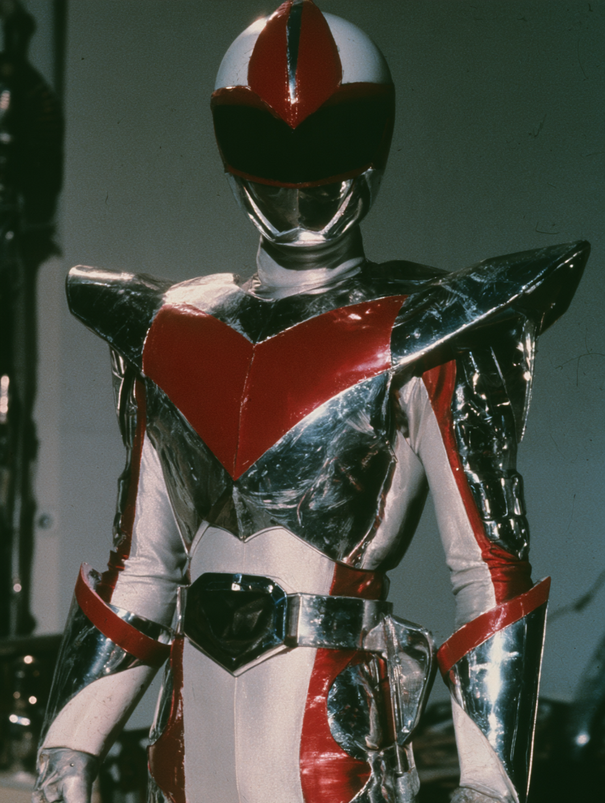
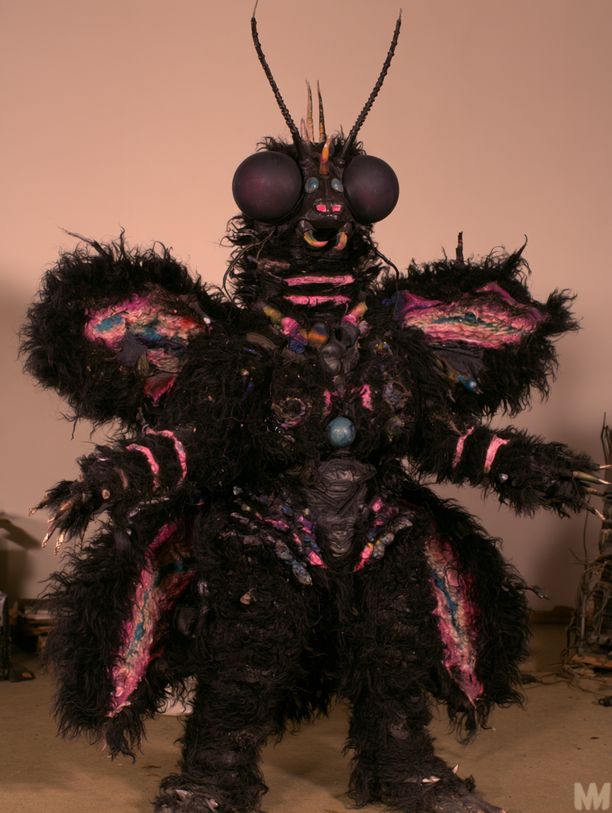
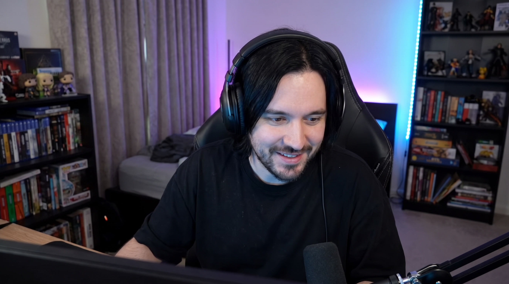
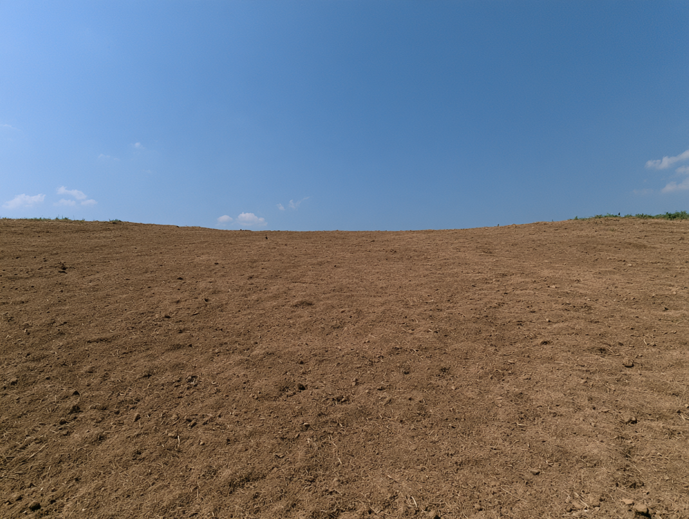

# OpenArt Director — AI Creative Ad Case Study

[▶ Watch the final ad](https://www.youtube.com/shorts/wSeOnk1fPMg)

A vertical ad created for OpenArt’s AI Content Creator creative assessment. The goal was to make the product part of the joke, not just something that appears in the end card.

**Role:** concept, generation, edit, captions, sound, final delivery

---

## Brief

Create a short-form **9:16 ad for OpenArt Director** built for social feeds.

The piece had to work as an actual creative, not a generic product demo: fast setup, clear visual premise, a recognizable social format, and a payoff that makes the act of directing the scene itself the product demonstration.

## Constraints

- Under 30 seconds
- 9:16 vertical delivery
- Split-screen / reaction-video language
- English dialogue with Japanese subtitles
- The product had to be part of the gag
- The concept still had to read without showing a conventional software walkthrough

## Creative Concept

I treated the ad as a fourth-wall-breaking **tokusatsu scene**.

A creator is directing a Japanese superhero sequence in real time. As the notes become more specific, the characters stop behaving like passive fictional subjects and begin reacting directly to the creator.

That structure turns **directing the scene** into the product demonstration. Instead of pausing the story to explain OpenArt Director, the product logic becomes the joke.

## My Role

I handled the piece end-to-end:

- Creative concept and comedic structure
- Character and visual development
- Keyframe generation
- Shot planning and AI video generation
- Character consistency across shots
- Voice and music generation
- Editing and pacing
- English + Japanese captions
- CTA and final delivery

## Production Stack & Workflow

- **Midjourney** — initial hero, kaiju and environment concept development
- **Nano Banana Pro** — streamer character development
- **OpenArt Director** — central directing and orchestration layer; references, shot development, iterative visual direction and scene construction
- **GPT Images via OpenArt Director** — storyboard and shot generation
- **Seedance via OpenArt Director** — animation and video generation
- **ElevenLabs** — voice generation
- **Suno** — music
- **CapCut** — edit, pacing, captions, sound and final delivery

The workflow started with a small set of visual references created outside OpenArt: the hero, kaiju and environment in Midjourney, and the streamer in Nano Banana Pro.

Those assets were then brought into OpenArt Director, where I developed the ad iteratively through the Director Mode chat—building the sequence shot by shot, refining performances and framing, generating storyboard frames with GPT Images, and animating the selected shots with Seedance.

OpenArt Director acted as the central production environment rather than just another generation tool in the stack.

---

## Visual References

### 01 — Hero

[View prompt →](./prompts/hero.md)

### 02 — Monster

[View prompt →](./prompts/monster.md)

### 03 — Streamer

[View prompt →](./prompts/streamer.md)

### 04 — Environment

[View prompt →](./prompts/environment.md)

---

## Final Result

A sub-30-second vertical creative built around one principle:

**the product demonstration should also be the joke.**

This project was created as a creative assessment and is presented here as a production case study, not as an official OpenArt campaign.
